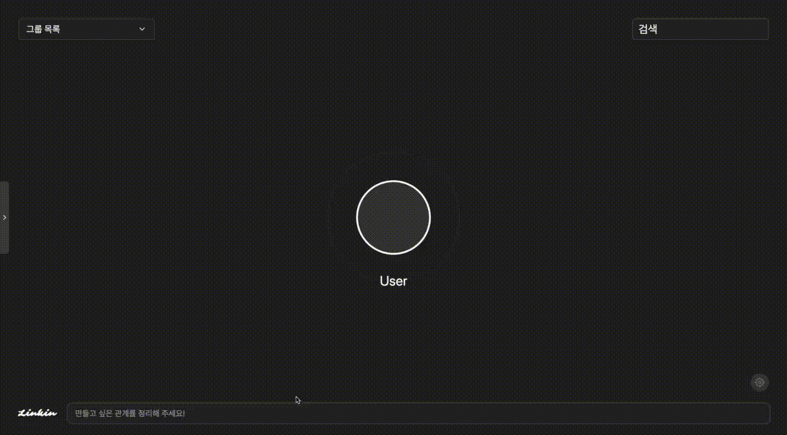
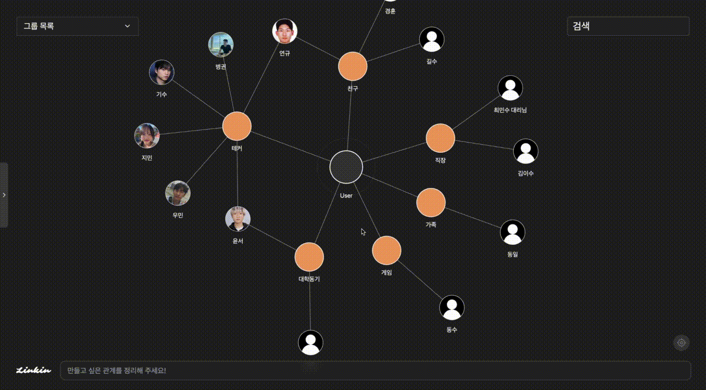
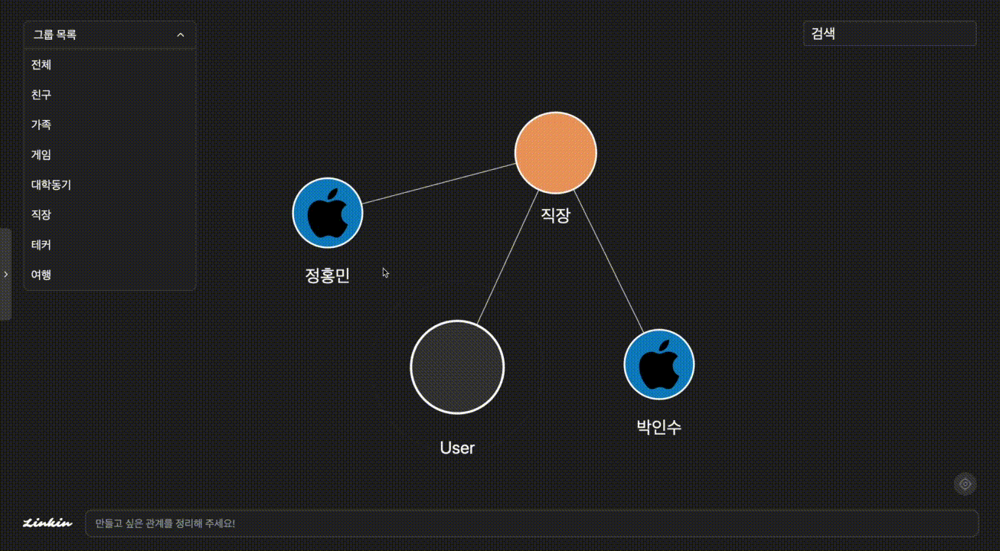
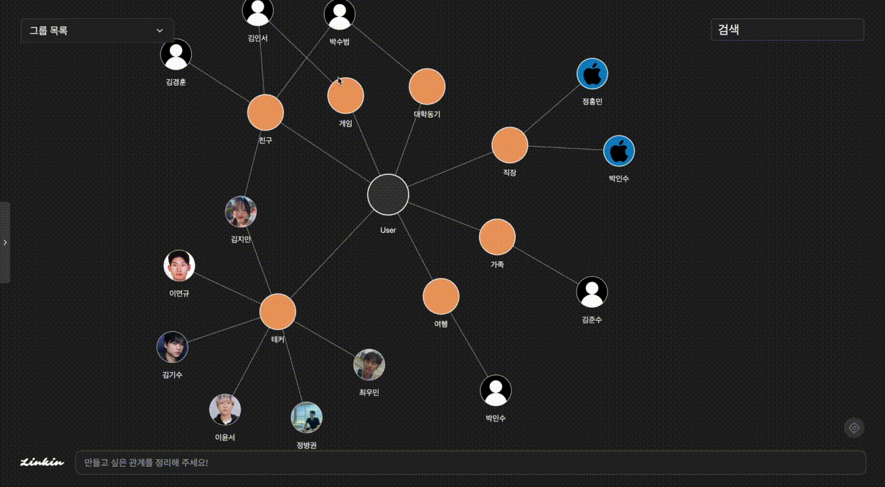

<h1 align="center"> 🔗 Link-In 🔗 </h1>

 
<h3><b>   </b></h3> 

<h3><b>Link between us   🔎관계를 기억하고 관리하는 가장 쉬운 방법</b></h3>
 

# 📌 Table of Contents
- [Introduction](#-Introduction)
- [Demo](#-Demo)
- [Medium](#-Medium)
- [System Architecture](#-System-Architecture)
- [Tech stack](#-Tech-stack)
- [ERD](#-Erd)
- [API](#-API)
- [Monitoring](#-Monitoring)
- [Members](#-Members)

 

# 📖Introduction
<h2>🚨 problem</h2>
<ul>
    <li><strong>학교에서 만나는 친구들, 직장에서 알게 된 사람, 대회에서 함께했던 팀원들까지!</strong></li>
    <li>우리는 수많은 사람들을 만나지만, <strong>관계를 정리하고 기억하는 건 쉽지 않습니다.</strong></li>
    <li>“이 친구를 어디서 만났더라?”, “같이 뭘 했지?” 같은 순간이 자주 찾아옵니다.</li>
    <li>이럴 때 우리는 카톡, 인스타그램, 캘린더 등 <strong>각종 메시지 앱과 기록 앱을 뒤져보지만</strong>,</li>
    <li>메시지가 너무 많거나 정리가 안 되어 결국 <strong>찾지 못한 채 지나가는 경우가 많습니다.</strong></li>
</ul>

<h2>✅ Solution! : LinkIn</h2>
<ul>
    <li><strong>사람들과의 관계를 한눈에 파악하고, 함께한 순간들을 자동으로 정리해주는 LinkIn을 만들었습니다.</strong></li>
    <li>사용자가 기록만 하면 그 이후 단계는 <strong>모두 자동으로 진행됩니다.</strong></li>
    <li><strong>AI가 인물 관계와 기록을 자동으로 정리</strong>하고, 이를 <strong>시각적으로 표시</strong>하여</li>
    <li>특정 인물과의 만남과 대화 내용을 손쉽게 확인할 수 있도록 도와줍니다.</li>
    <li>이제 더 이상 소중한 인연을 놓치지 마세요! 😊</li>
</ul>

 

# 🎥 Demo + Main Features

### 🚀Main Feature
> 사용자가 원하는 기록을 입력합니다.
> Link-In 이 알아서 사용자와의 관계까지 정해줍니다!
 

  

### 😊Login
> 로그인하여 Link-In 에 접속합니다.
 

  

### 💽Innit Animation
> Link-In 에 접속시 보이는 사용자가 생성한 관계도 입니다.
 

  

### 🎛️ViewMemo
> 사용자가 기록한 메모를 확인합니다.
 

  

### 🔦ViewCategory
> 사용자가 생성한 여러 관계들을 확인할 수 있습니다.
 

  

### 💡Search
> 유연한 검색을 통해 과거의 기억을 찾을 수 있습니다.
 

  

 

# 📋 Medium
  🔖 [ Link - In ](https://medium.com/@sujean07015/linkin-bf4d4d1433b0)

 

# 🚨 System Architecture

 

# 🛠 Tech stack 
 

분야| 사용 기술|
:--------:|:------------------------------:|
**Frontend** |       
**Backend** |       
**DevOps** |         
**Monitoring** |       
**etc** |         

 

# 💎 ERD

 

# 📙 API

 

# 🔬 Monitoring

 

# 👨‍👩‍👧‍👦 Members

## 라이센스

MIT &copy; [NoHack](mailto:lbjp114@gmail.com)

