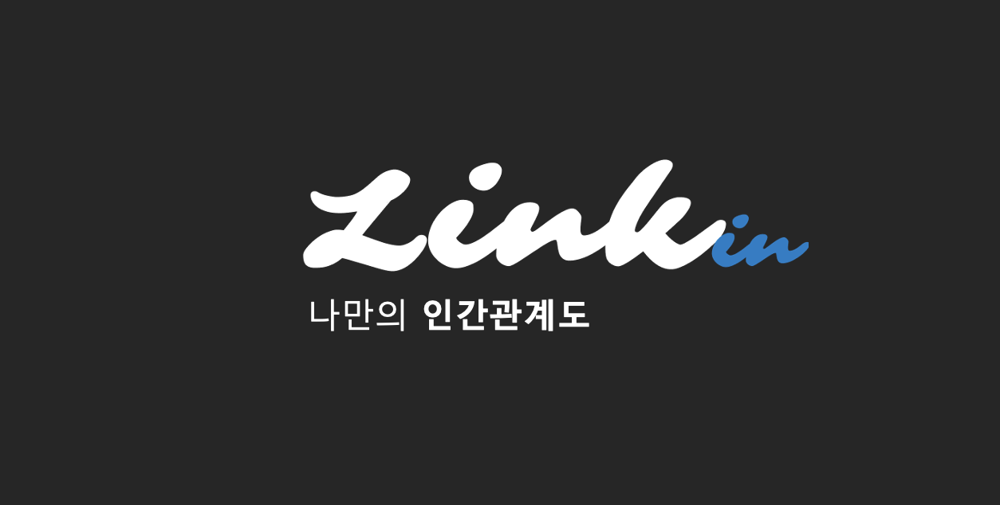
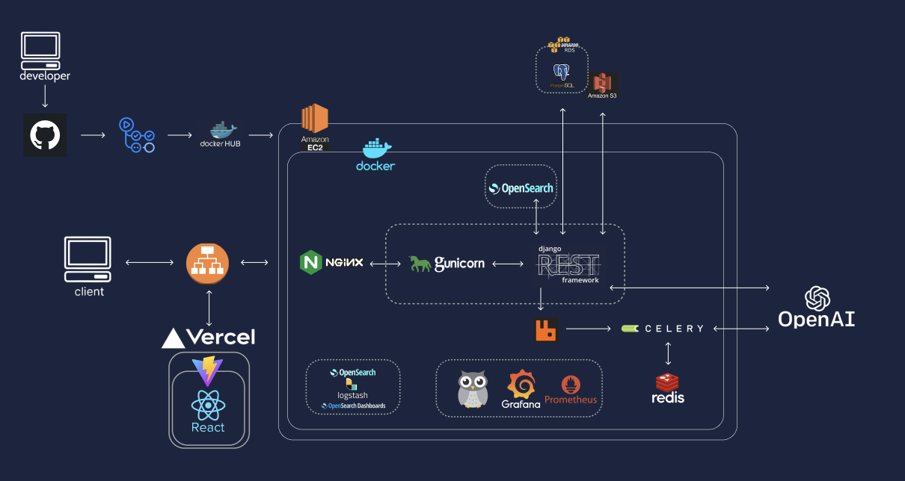
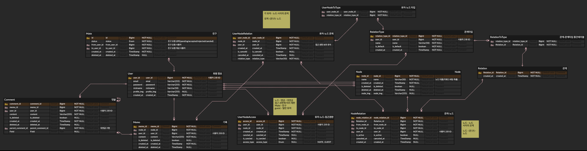
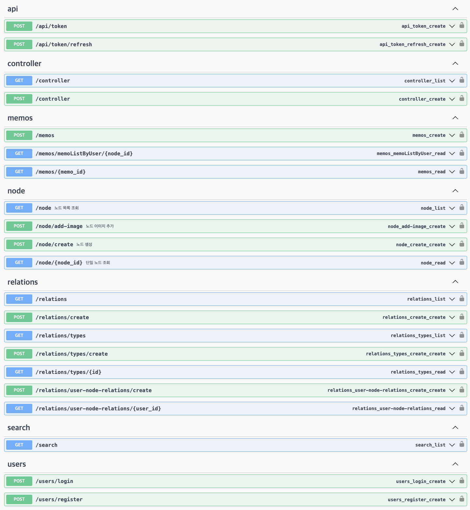
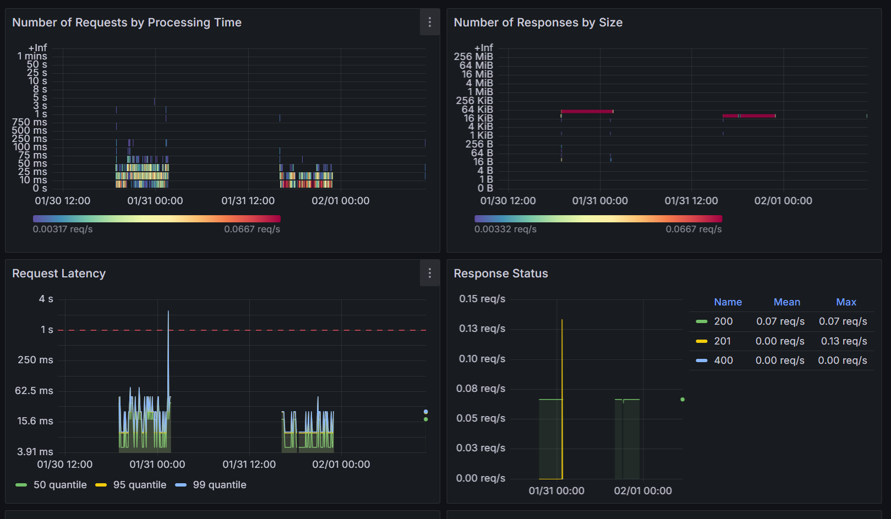
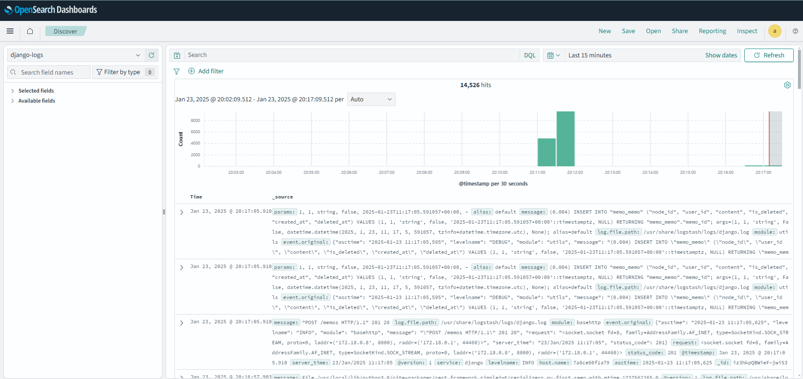
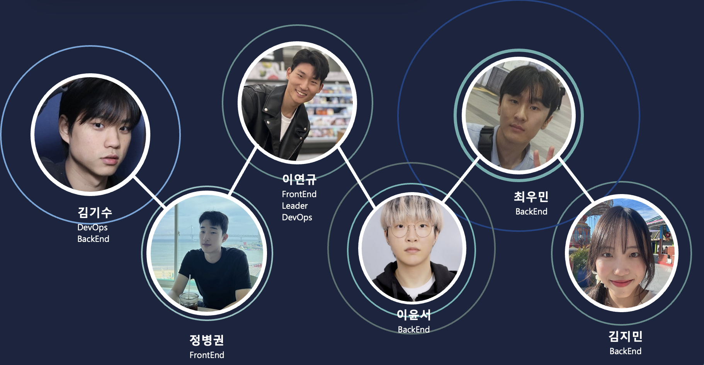

## Link-In 👋

   
  
   

목차

## 프로젝트 소개

프로젝트 개요/동기

GIF Images

 

## 라이센스

MIT &copy; [NoHack](mailto:lbjp114@gmail.com)

## 📌 Table of Contents
- [Medium](#-Medium)
- [Demo](#-Demo)
- [System Architecture](#-System-Architecture)
- [Tech stack](#-Tech-stack)
- [ERD](#-Erd)
- [API](#-API)
- [Monitoring](#-Monitoring)
- [Members](#-Members)

 

## 📋 Medium
  🔖 [ Link - In ](https://medium.com/@sujean07015/linkin-bf4d4d1433b0)

 

## 🎥 Demo

## 🚨 System Architecture

## 🛠 Tech stack 
 

 
분야| 사용 기술|
:--------:|:------------------------------:|
**Frontend** |       
**Backend** |      
**DevOps** |         
**Monitoring** |       
**etc** |     

 

## 💎 ERD

 

## 📙 API

 

## 🔬 Monitoring

 

## 👨‍👩‍👧‍👦 Members

